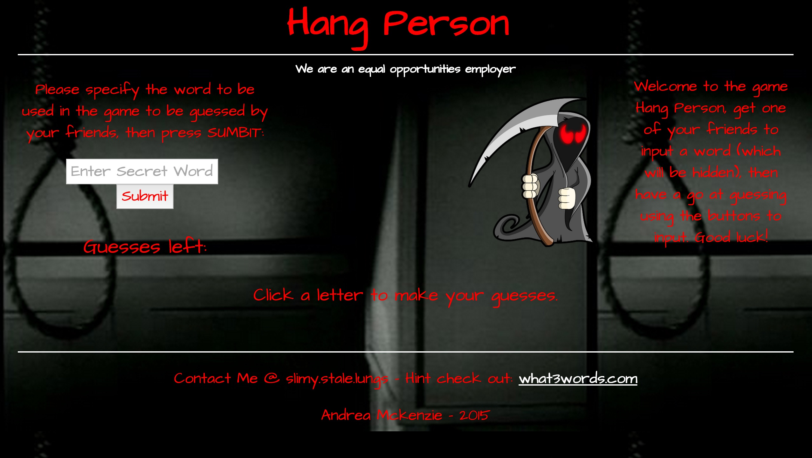

# WDI PROJECT 1 - THE GAME

### Creating a Hangman type game

**Hang Person** is a simple word guessing gaming that can be played with friends, it has a dark theme based on the dark arts. (This game is still in beta).

The idea of the game is simple, guess the word before you end up feeling the **noose!**.

**A link to the game:** https://hang-person.herokuapp.com/

The home page of the game:

*Image copyrights remain with their owners.*
Grim Reaper - http://www.wpclipart.com/holiday/halloween/grim_reaper/Grim_Reaper_red_eyes.png.html

Background Image - http://ak6.picdn.net/shutterstock/videos/1830875/preview/stock-footage-panning-hangman-s-noose.jpg

Open source code bases were used to assist with this project.

**Technologies used: **
HTML, CSS, JAVASCRIPT

Most of the could is just pure HTML, CSS and JavaScript, a Google font (Architects+Daughter) was used, and normalize.css was used to standardize the CSS across browsers.  There is a little JQuery use as well.

**Problems and what Next**

I found it challenging coming up with the functionality of the game in code, as opposed to my head.
Styling the game was interesting, especially as some elements could not been seen until certain actions had happened.

* Would like to improve the game by displaying various images when selecting the letters.
* Make it mobile responsive.

Made with ❤️ l . o . v . e by me :)

